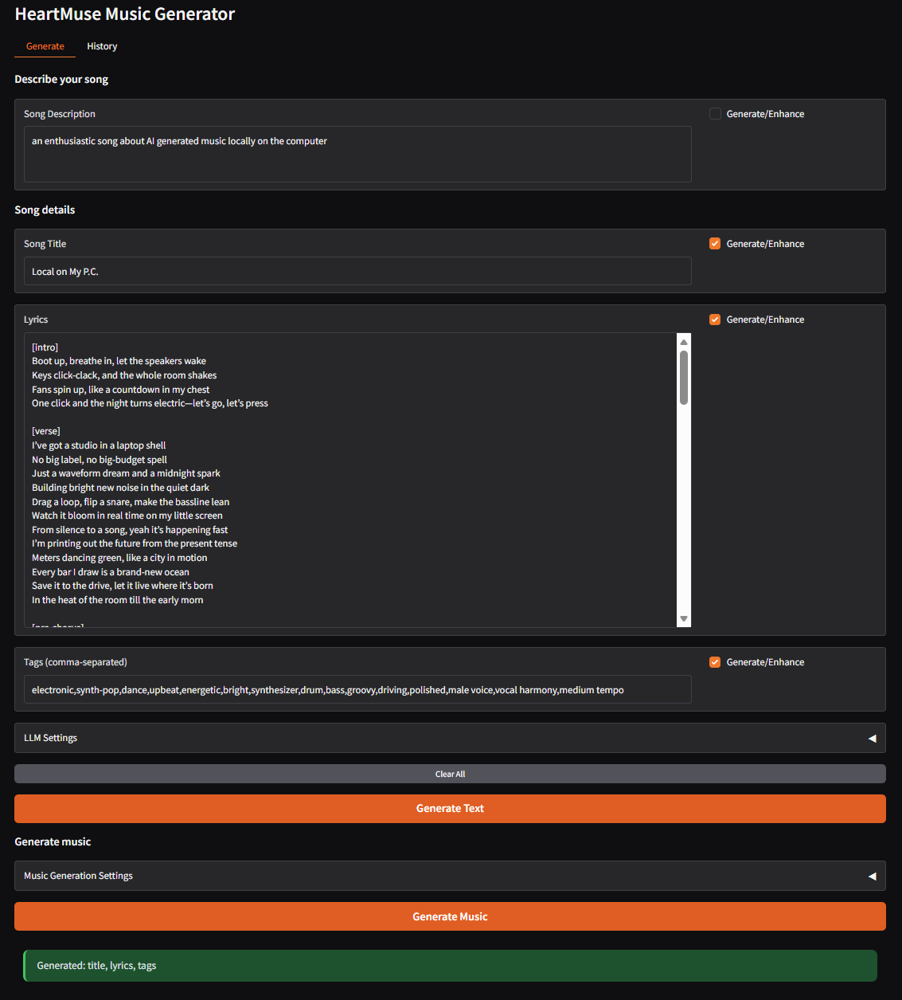

# HeartMuse - AI Music Generator with Smart Lyrics

**HeartMuse** is an intuitive web-based interface for creating high-quality AI-generated music **completely locally** on your machine. It combines the power of **HeartMuLa** (state-of-the-art open-source music generation model) with intelligent lyrics generation using local LLMs, giving you complete creative control without relying on cloud services.



## Get Started in 2 Minutes

```bash
# 1. Clone and install
git clone https://github.com/strnad/heartmuse.git
cd heartmuse
./install.sh      # Linux/macOS
# or: install.bat   # Windows

# 2. Run
./run.sh          # Linux/macOS
# or: run.bat       # Windows
```

Open **http://localhost:7860** and start creating!

> **That's it!** The installer automatically creates a virtual environment, clones the HeartMuLa library, and installs all dependencies. AI models download automatically on first generation.

---

## Why HeartMuse?

### Flexible Text Generation - Total Creative Control

HeartMuse features a **modular, field-by-field generation system** that adapts to your creative workflow. Every field has its own "Generate/Enhance" checkbox, giving you granular control over what AI generates and what you write yourself.

#### Four Independent Fields, Endless Combinations

| Field | What It Does | Generate/Enhance Checkbox |
|-------|-------------|---------------------------|
| **Description** | Your creative brief for the song | AI can expand vague ideas into detailed descriptions |
| **Title** | Song name | AI suggests catchy, thematic titles |
| **Lyrics** | Full song text with sections | AI writes/extends verses, choruses, bridges |
| **Tags** | Music production tags for HeartMuLa | AI suggests genre, mood, instruments, tempo |

**Each checkbox is independent** - mix and match any combination:
- All four checked - AI generates everything from scratch
- Only lyrics checked - AI writes lyrics, you control title and tags
- Title + tags checked - You write lyrics, AI handles metadata
- Nothing checked - Use exactly what you entered, no AI changes

#### Context-Aware Intelligence

The magic happens when you **provide partial content**:

```
+----------------------------------+--------------------------------+
| You provide:                     | AI understands:                |
+----------------------------------+--------------------------------+
| Description: "upbeat summer"     | -> Uses as creative direction  |
| Title: (empty)                   | -> Will generate               |
| Lyrics: "Feel the sunshine"      | -> Context for generation      |
| Tags: (empty)                    | -> Will generate               |
|                                                                   |
| Checkboxes: [x] Title  [x] Tags  [ ] Lyrics                       |
|                                                                   |
| Result: AI generates title and tags that match YOUR lyrics        |
|         and description. Your lyrics stay untouched.              |
+-------------------------------------------------------------------+
```

**Unchecked fields with values become context** - AI reads them but won't modify them. This ensures coherent results that respect your creative input.

#### Smart Lyrics Preservation

When extending existing lyrics, HeartMuse offers **two levels of protection**:

| Syntax | Protection Level | Use Case |
|--------|-----------------|----------|
| `"exact text"` | **100% locked** - never changed, character-for-character | Your signature lines, hooks |
| `regular text` | **Preserved** - meaning kept, minor polish allowed | Draft verses you want improved |

**Example:**
```
[chorus]
"This exact line will never change!"
This line might get slight improvements
```

Result: The quoted line is untouchable. The unquoted line may be refined while keeping its meaning.

#### Extend, Don't Replace

When "Generate/Enhance" is checked for lyrics that already have content:
- AI **adds** new sections (verses, bridge, outro)
- AI **completes** unfinished sections
- AI **preserves** everything you wrote
- AI **never deletes** your content
- AI **never rewrites** existing sections from scratch

#### Duration-Aware Lyrics

Set your target song length, and AI adjusts lyrics accordingly:

| Duration | AI Behavior |
|----------|-------------|
| Under 60s | Short and punchy - 1-2 sections |
| 60-120s | Standard structure - verse, chorus, verse |
| Over 120s | Extended - multiple verses, bridge, outro |

#### From-Scratch Creative Mode

Leave all fields empty and click "Generate Text" - AI creates a completely original song concept:
- Invents a unique theme and story
- Writes complete lyrics with proper structure
- Suggests a fitting title
- Recommends appropriate musical tags

**Each generation is different** - use this for inspiration or when you want to be surprised!

---

### Real-World Workflow Examples

#### Example 1: Full AI Generation
```
Input:   (everything empty, all checkboxes checked)
Output:  Complete original song - title, lyrics, tags, ready for music generation
```

#### Example 2: Your Lyrics, AI Metadata
```
Input:   Your complete lyrics in the Lyrics field
         [ ] Description  [ ] Lyrics  [x] Title  [x] Tags
Output:  AI suggests a perfect title and musical tags that match YOUR lyrics
```

#### Example 3: Expand a Hook
```
Input:   Lyrics: "[chorus]\nDancing in the moonlight"
         [x] Lyrics checked
Output:  AI keeps your chorus and adds verses, bridge, outro around it
```

#### Example 4: Protected Refrain + AI Verses
```
Input:   Lyrics:
         [chorus]
         "We are the champions, my friend"
         "And we'll keep on fighting till the end"

         [verse]
         (something about struggle and victory)

         [x] Lyrics checked

Output:  Quoted chorus: 100% unchanged
         Verse placeholder: AI writes full lyrics about struggle and victory
```

#### Example 5: Enhance Vague Description
```
Input:   Description: "sad piano song"
         [x] Description checked
Output:  Description expanded to: "A melancholic piano ballad with introspective
         lyrics about lost love, featuring gentle arpeggios and emotional vocal
         delivery in a minor key"
```

#### Example 6: Iterative Refinement
```
Round 1: Generate title + lyrics from description
Round 2: Read lyrics, uncheck lyrics, add specific tags manually
Round 3: Generate music with your curated combination
```

---

### 100% Local & Private

- **Ollama backend** - everything runs on your computer, no data leaves your machine
- **Or OpenAI API** - for those who prefer cloud models
- **Switch with one click** - choose your backend based on the situation

### Effortless HeartMuLa Setup

Forget manual model downloads, path configuration, and dependency hell:

```
./install.sh  ->  Done!
```

HeartMuse handles everything:
- Creates an isolated Python environment
- Clones and installs [HeartMuLa library](https://github.com/HeartMuLa/heartlib)
- Installs all dependencies automatically
- Downloads models on first use (from Hugging Face)
- Configures optimal settings for your hardware

---

## Configuration

Create a `.env` file (or copy `.env.example`):

```bash
# LLM Backend (Ollama = local, OpenAI = cloud)
LLM_BACKEND=Ollama

# For Ollama
OLLAMA_MODEL=glm-4.7-flash

# For OpenAI
# OPENAI_API_KEY=sk-...

# Music generation parameters
MUSIC_MAX_LENGTH_SEC=120
```

### Setting Up Ollama (Recommended)

```bash
# 1. Install Ollama from https://ollama.ai
# 2. Download a model
ollama pull glm-4.7-flash

# 3. Start (if not running automatically)
ollama serve
```

## How It Works

```
+------------------+     +------------------+     +------------------+
|   Your Input     | --> |   LLM (Ollama/   | --> |   HeartMuLa      |
|   + checkboxes   |     |   OpenAI)        |     |   Music Gen      |
+------------------+     |                  |     |                  |
                         |  Generates:      |     |  Creates:        |
                         |  - Title         |     |  - Audio file    |
                         |  - Lyrics        |     |  - High-quality  |
                         |  - Tags          |     |    music         |
                         +------------------+     +------------------+
```

## Memory Optimization

For GPUs with limited VRAM:

- **Lazy loading** (default) - reduces VRAM footprint
- **"Unload Model" button** - frees memory between generations
- **Shorter song length** - reduce `MUSIC_MAX_LENGTH_SEC`

## Troubleshooting

| Problem | Solution |
|---------|----------|
| "Out of memory" | Reduce song length, use "Unload Model" |
| Ollama not connecting | Verify `ollama serve` is running |
| Models not downloading | Check internet connection |

## Acknowledgments

HeartMuse builds on the excellent work by the **HeartMuLa** team:
- [HeartMuLa/heartlib](https://github.com/HeartMuLa/heartlib) - Music generation model
- HeartCodec - High-quality audio codec

## Support the Project

[](https://github.com/sponsors/strnad)

**Bitcoin:** `bc1qgsn45g02wran4lph5gsyqtk0k7t98zsg6qur0y`

## License

MIT License - see [LICENSE](LICENSE)

The HeartMuLa library has its own license - refer to the [HeartMuLa repository](https://github.com/HeartMuLa/heartlib).

---

**Made with HeartMuLa | Developed with assistance from [Claude Code](https://claude.ai/code)**

*Create music with AI, own your creativity*
